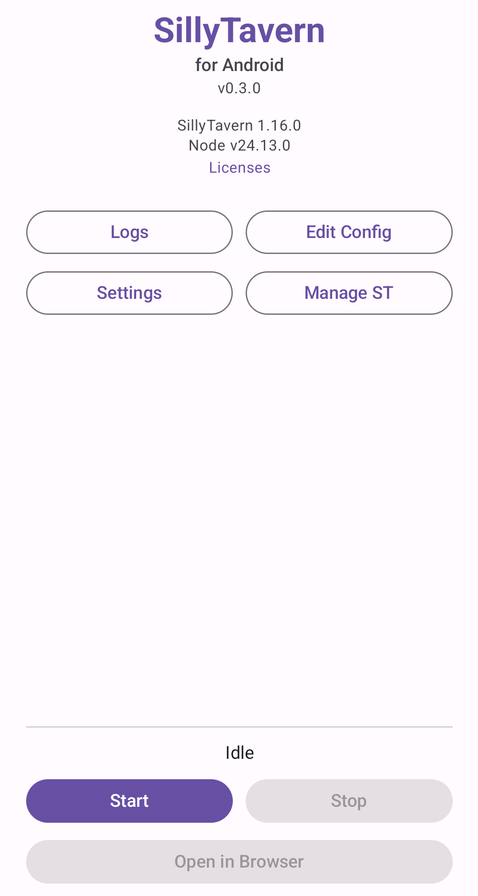

# ST-android-setting

[English](README_en.md) | 中文

第三方 SillyTavern 安卓客户端。基于 [Sanitised/ST-android](https://github.com/Sanitised/ST-android) 的嵌入式 Node.js 运行时，开发原生 Android 界面与扩展功能。




> 本项目是独立的第三方分支，与 SillyTavern 官方及上游 ST-android 项目均无关联。

## 与上游的关系

本项目 fork 自 [Sanitised/ST-android](https://github.com/Sanitised/ST-android)，沿用其核心能力：

- **嵌入式 Node.js 运行时** — 在 Android 设备上直接运行 SillyTavern 服务端，无需 Termux 等额外工具
- **APK 内打包 SillyTavern 源码** — 开箱即用，零配置

在此基础上，本项目着重发展：

- **原生 Compose UI** — 使用 Jetpack Compose + Material 3 构建角色管理、设置、工具等原生界面，替代纯 WebView 方案
- **底部导航架构** — 首页 / 聊天 / 角色 / 工具 / 设置五个标签页
- **角色管理迁移** — 角色列表、详情、编辑等功能逐步迁移至原生实现
- **仪表盘首页** — 状态卡片、最近聊天、快捷操作等

## 功能特性

- 一键运行 SillyTavern，支持 Android 8.0+（arm64）
- 原生角色管理界面（列表、详情、编辑、标签、筛选）
- 导入/导出系统，兼容本应用备份格式与 SillyTavern 原生备份
- 自定义 SillyTavern 版本：任意版本/分支/仓库/ZIP 安装
- 深色/浅色主题
- 自动打开浏览器

## 隐私

- 无任何遥测。
- 支持在 Private Space / 安全文件夹 / 多用户配置中使用。
- 网络请求极少：仅可选的 GitHub 更新检查、npm 安装和自定义版本下载。其余流量均来自 SillyTavern 本身。
- 所有聊天、角色、设置均保存在本地。

## 安装

从 [Releases](https://github.com/5151561/ST-android-setting/releases/latest) 下载 APK（如 Android 提示，请允许从浏览器/文件管理器安装）。

## 数据迁移

从 Termux 或 PC 上的 SillyTavern 迁移数据，支持 `.tar.gz`、`.tar`、`.zip` 格式，自动识别。

### 方法一：使用 SillyTavern 用户备份

1. 在旧的 SillyTavern 中：**User Settings** → **Account** → **Download Backup**
2. 在本应用中：停止服务 → **管理 ST** → **导入数据** → 选择备份文件

### 方法二：一键导出脚本（Termux / Linux）

```bash
bash <(curl -sSf https://raw.githubusercontent.com/Sanitised/ST-android/master/tools/export_to_st_android.sh)
```

如果 SillyTavern 不在默认路径，先 `cd ./my-sillytavern`。

然后在应用中：停止服务 → **管理 ST** → **导入数据** → 选择备份文件。

### 方法三：手动打包

归档结构：

```
st_backup/
├── config.yaml
└── data/
```

```bash
mkdir st_backup
cp /path/to/sillytavern/config.yaml st_backup/
cp -r /path/to/sillytavern/data st_backup/
tar -czf st_backup.tar.gz st_backup/
```

Termux 下复制到 Downloads：

```bash
termux-setup-storage
cp st_backup.tar.gz ~/storage/downloads/
```

## 构建

需要 Docker（以及 Git）。仅在 Linux 上测试通过。

```bash
git clone https://github.com/5151561/ST-android-setting
cd ST-android-setting
git submodule update --init --recursive
./ci/scripts/build_apk_docker.sh
```

首次构建需 2-3 小时（从源码编译 Node.js），后续构建快得多。

输出：`app/build/outputs/apk/debug/app-debug.apk`

## 文档

- 完整知识库：[wiki/Home.md](wiki/Home.md)
- 用户指南：[wiki/User-Guide.md](wiki/User-Guide.md)
- 开发者指南：[wiki/Developer-Guide.md](wiki/Developer-Guide.md)
- 当前架构详版：[docs/architecture.md](docs/architecture.md)
- 研发档案索引：[docs/README.md](docs/README.md)

## 更新日志

见 [CHANGELOG.md](CHANGELOG.md)。

## 致谢

- [Sanitised/ST-android](https://github.com/Sanitised/ST-android) — 上游项目，提供嵌入式 Node.js 运行时与核心架构
- [SillyTavern](https://github.com/SillyTavernAI/SillyTavern) — 前端聊天界面
