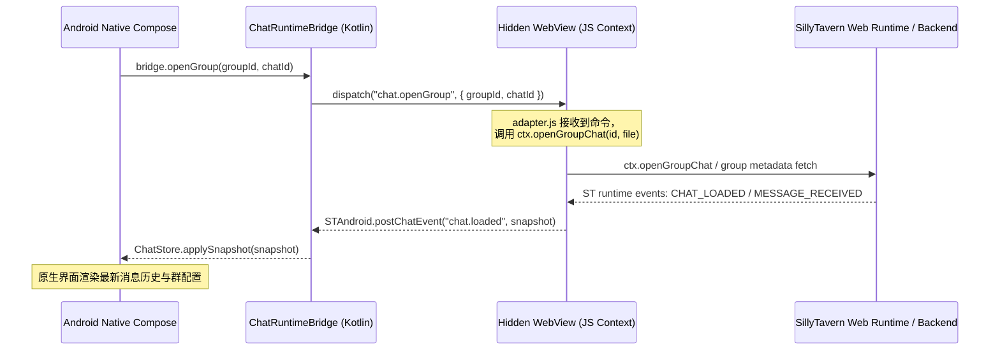

# SillyTavern 移动端群聊原生 API 迁移与对接方案

本文件为 Android 客户端原生 Jetpack Compose 群聊功能（`GroupChatScreen`、`GroupMembersScreen`、`GroupSettingsScreen`、`NewGroupScreen`）接入 SillyTavern 后端 Node.js 服务端提供详细的 API 对接、数据流与分阶段迁移落地指导。

> [!IMPORTANT]
> **开发状态说明**
> 当前新增的 Android 原生群聊 UI（包括会话、设置、成员管理和新建屏幕）完全处于**静态高保真复现与交互演示阶段**。
> 所有交互均在移动端使用静态 Mock / Demo 数据完成，**尚未与真实后端服务（REST API 或 WebView/JS Bridge 桥接）进行端到端连通联调**。
>
> 新建群聊界面中的 `onCreate` 动作目前仅作为一个**静态占位符并返回上一页**，尚未发起真实的 `POST /api/groups/create` 网络请求。

---

## 1. 架构概述与双端桥接机制

SillyTavern 移动端并不是通过原生的 TCP WebSocket / HTTP 直接同 Node.js 后端同步数据，而是采用**隐藏式 WebView 容器 + JS Bridge 桥接总线**的机制来实现的：

1. **隐藏式 WebView 容器 (`ChatWebViewScreen`)**：作为一个运行着 SillyTavern 网页客户端上下文的沙盒。
2. **JS Bridge 桥接层 (`ChatRuntimeBridge.kt` 与 `chat_runtime_adapter.js`)**：
   - Android 原生 Compose UI 通过 `ChatRuntimeBridge.dispatch(msg)` 将控制指令（以 JSON 字符串形式）派发至 WebView。
   - WebView 中的 JS 适配器接收到指令（例如 `chat.openGroup`），在 SillyTavern 网页上下文中找到对应的核心 API（如 `SillyTavern.getContext().openGroupChat`）并触发动作。
   - WebView JS 监听 SillyTavern 内部事件（如 `GENERATION_STARTED`、`MESSAGE_RECEIVED`），将其转化为原生事件流推送给 Android 端的 `ChatStore`。

### 1.1 群聊会话打开数据流向图



---

## 2. 后端 REST API 接口映射与 JSON 字段

移动端进行高级设置修改或群组创建时，底层需通过 HTTP 请求直接调用后端 Node.js 网关接口。

### 2.1 获取所有群组
* **接口**：`POST /api/groups/all`
* **请求载荷**：`{}`
* **响应格式**：返回所有群组的元数据数组。

```json
[
  {
    "id": "1717001234567",
    "name": "雨夜小聚",
    "members": ["aria", "eleanor", "kael"],
    "avatar_url": "img/ai4.png",
    "allow_self_responses": false,
    "activation_strategy": 0,
    "generation_mode": 0,
    "disabled_members": ["kael"],
    "fav": true,
    "chat_id": "1717001234567",
    "chats": ["1717001234567"],
    "auto_mode_delay": 5,
    "date_last_chat": 1717001290000,
    "chat_size": 25480
  }
]
```

### 2.2 创建新群聊 (静态占位阶段)
* **接口**：`POST /api/groups/create`
* **请求载荷**：
```json
{
  "name": "雨夜小聚",
  "members": ["aria", "eleanor", "kael"],
  "avatar_url": "img/ai4.png",
  "allow_self_responses": false,
  "activation_strategy": 0,
  "generation_mode": 0,
  "disabled_members": [],
  "fav": false,
  "auto_mode_delay": 5
}
```
* **响应**：创建成功返回新建群组的元数据 JSON。
* **注意**：`NewGroupScreen` 的 `onCreate` 目前为占位逻辑，待迁移至阶段三后接入此接口。

### 2.3 修改群组设置
* **接口**：`POST /api/groups/edit`
* **请求载荷**：发送完整的群组元数据对象覆盖写入（必须包含 `id`）。
```json
{
  "id": "1717001234567",
  "name": "雨夜小聚 (修改版)",
  "members": ["aria", "eleanor", "kael"],
  "avatar_url": "img/ai4.png",
  "allow_self_responses": true,
  "activation_strategy": 1,
  "generation_mode": 1,
  "disabled_members": ["kael"],
  "fav": true,
  "chat_id": "1717001234567",
  "chats": ["1717001234567"],
  "auto_mode_delay": 8
}
```

### 2.4 删除群聊
* **接口**：`POST /api/groups/delete`
* **请求载荷**：`{ "id": "1717001234567" }`
* **响应**：`{ "ok": true }`

---

## 3. UI 界面与后端功能属性映射矩阵

为了保证前后端字段的严格一致，避免数据 desync，下表列出了原生 UI 组件状态与 SillyTavern 后端物理字段的对齐关系：

| 原生 Compose UI 变量 | 页面组件位置 | 对应真实 ST 后端 JSON 字段 | 字段取值与业务逻辑 |
|---|---|---|---|
| `groupName` | `GroupSettingsScreen`<br>`NewGroupScreen` | `name` | 群组标题字符串 |
| `strategy` | `GroupSettingsScreen`<br>`NewGroupScreen` | `activation_strategy` | **回复策略**：<br>0 = 自然顺序 (Natural order)<br>1 = 列表顺序 (List order)<br>2 = 手动点名 (Manual)<br>3 = 池化顺序 (Pooled order) |
| `genMode` | `GroupSettingsScreen`<br>`NewGroupScreen` | `generation_mode` | **生成模式**：<br>0 = 切换角色卡 (Swap)<br>1 = 合并角色卡 · 排除静音 (Join/exclude muted)<br>2 = 合并角色卡 · 含静音 (Join/include muted) |
| `autoDelay` | `GroupSettingsScreen` | `auto_mode_delay` | **自动接龙延迟**（Slider）：整型秒数 |
| `selfResponses` | `GroupSettingsScreen` | `allow_self_responses` | **角色自我回复**（Switch）：布尔值 |
| `fav` | `GroupSettingsScreen` | `fav` | **收藏此群聊**（Switch）：布尔值 |
| `muted` | `GroupMembersScreen` | `disabled_members` | **群成员静音列表**：<br>当成员静音时，其 ID 会被追加进 `disabled_members` 数组中，从群聊生成上下文中移除。 |

---

## 4. JS Bridge 双向控制事件帧

Android 原生端与 WebView 的桥接信道中，消息格式严格对齐如下：

### 4.1 触发 AI 文本生成与重写 (由桥接控制)
SillyTavern 后端并没有独立的 `/api/groups/generate` REST 接口，所有的群聊回复生成均依赖 `chat_runtime_adapter.js` 执行 UI 模拟或通过 SillyTavern 内部事件队列推进。
- **触发生成**：原生端通过 Bridge 派发 `"chat.send"`，携带 `{ "text": "用户消息内容" }`。
- **重新生成回复**：原生端派发 `"generation.regenerate"` 命令。在群聊模式下，适配器会自动调用 `group-chats.js` 中的 `regenerateGroup()` 方法，自动删除本轮已有的 AI 响应并重新请求文本生成服务。
- **停止生成**：原生端派发 `"generation.stop"` 命令，触发网页端停止生成动作。

### 4.2 适配器上报至原生的事件
- **`runtime.ready`**：SillyTavern 沙盒环境及角色卡全部加载完毕，可开始交互。
- **`chat.loaded`**：上报 `ChatSnapshot` 结构，包含历史消息列表 `messages`（数组中每个 `ChatMessage` 通过 `name` 标记发言人）以及 `avatarUrl`、`chatFile` 等元数据。
- **`generation.started`** 和 **`generation.ended`**：控制原生打字指示器 `TypingRow` 的显示与隐藏。
- **`stream.token`**：增量字符推送事件，实时给原生 `ChatStore` 追加流式文本，保障脉动式文字更新动效。

---

## 5. 四阶段平滑迁移路线图

### 阶段 1：高保真 UI 与 Prototype 静态占位 (当前完成)
- **任务**：完全由移动端 Mock 数据驱动，还原高精度的 MD3 深浅色自适应界面，挂载至主 Activity 导航网格。

### 阶段 2：Android 桥接总线与群聊状态绑定
- **任务**：复用并验证 `ChatRuntimeBridge.kt` 中已有的 `"chat.openGroup"`、`"chat.send"`、`"generation.regenerate"` 等核心指令派发能力；扩展 `ChatStore` 的数据结构，使其能支持群聊元数据的动态更新（包括处理 `disabled_members`）。

### 阶段 3：SillyTavern 网页沙盒事件适配器绑定
- **任务**：测试 WebView 容器中 `chat_runtime_adapter.js` 的 `handleOpenGroup` 和 `handleRegenerate` 兼容性。确保在群聊触发生成时，适配器能监听 SillyTavern 的 `STREAM_TOKEN_RECEIVED` 内部事件，并以 `stream.token` 事件帧实时推送至原生 UI。

### 阶段 4：接口与业务整合调试
- **任务**：真机联调。验证群组“生成模式”在切换为“合并角色卡”时，后端是否能正确获取多个角色的系统 Prompt 并拼接；测试静音与重排操作在 `/api/groups/edit` 提交后，是否能即时刷新生成队列。
