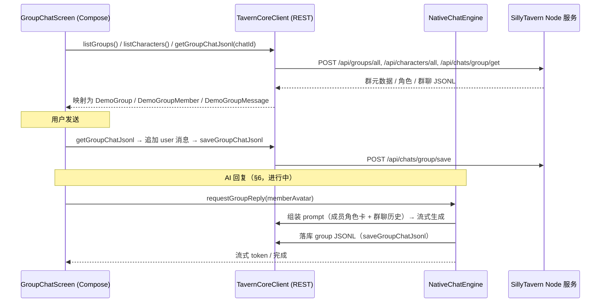

# SillyTavern 移动端群聊原生 API 迁移与对接方案

> 2026-06-24 当前口径：1v1 聊天也已和群聊一样退出隐藏 WebView runtime；旧 Bridge 方案只保留为历史记录。当前实现见 `docs/native-chat-runtime-exit-status.md`。

本文件为 Android 客户端原生 Jetpack Compose 群聊功能（`GroupChatScreen`、`GroupMembersScreen`、`GroupSettingsScreen`、`NewGroupScreen`）接入 SillyTavern 后端 Node.js 服务端提供 API 对接、数据流与分阶段落地指导。

> [!IMPORTANT]
> **架构决策（v2 · 2026-06-02）**
> 群聊**保留现有 demo 高保真 Compose UI**（`GroupChatScreen` 一套），**废弃** NativeChatScreen + JS Bridge 那条“真实链路群聊”。
> 群聊数据走**本地 REST API 直连**（`TavernCoreClient`），AI 回复走 **`NativeChatEngine` 原生生成**（与 1v1 同一套 prompt/stream 管线），**不经隐藏 WebView 运行时**。
>
> 2026-06-24 更新：1v1 已与群聊统一到纯原生聊天链路。本文 §1 仅作历史记录保留旧 Bridge 方案，实际实现以 §1.1 之后以及 `docs/native-chat-runtime-exit-status.md` 为准。

---

## 0. 开发状态

| 能力 | 状态 | 说明 |
|---|---|---|
| 新建群聊（`POST /api/groups/create`） | ✅ 已落地 · 真机验证 | `NewGroupScreen` 读真实角色多选 + strategy 映射；创建落库、列表刷新、成员格式 `default_Seraphina.png` 均已真机确认 |
| 群聊列表（`POST /api/groups/all`） | ✅ 已落地 | `PrototypeGroupChatScreen` 经 `listGroups()` 渲染，返回列表自动刷新 |
| 群聊详情：真实群/成员/历史 | ✅ 已落地 | `GroupChatScreen(groupId, chatId, baseUrl)` 经 `listGroups()` + `listCharacters()` + `getGroupChatJsonl()` 加载 |
| 群聊详情：用户发送消息 | ✅ 已落地 | 追加 UI + 真实落库（`saveGroupChatJsonl`，群聊 JSONL） |
| 群聊 AI 回复（原生生成） | ✅ MVP 已落地 | `NativeGroupGenerator`：按 strategy 选发言人（`pickGroupSpeaker`）→ 该成员角色卡 + 群聊历史经 `PromptBuilder`/`TextPromptBuilder` 组装 → 流式生成（含非流式兜底）→ 落库群聊 JSONL。入口：点名 / 重写 / 继续 / 发言人 sheet / 自动接龙。**限制见 §6.5**，需真机验证 |
| 对话切换（历史 sheet） | ✅ 已落地 | `ConversationSwitcherSheet` 列出真实群聊存档（`group.chats`），可切换会话、新建会话（写回 `chat_id`/`chats`） |
| 群设置（`/api/groups/edit`） | ✅ 已落地 | `GroupSettingsScreen` 接真实数据；名称/策略/生成模式/自动延迟/自我回复/收藏 去抖持久化；删除群聊（确认弹窗 + `/api/groups/delete`） |
| 群成员（`/api/groups/edit`） | ✅ 已落地 | `GroupMembersScreen` 接真实成员/候选；静音→`disabled_members`、顺序→`members`、增删成员，「完成」时写回 |
| swipe 持久化 | ✅ 已落地 | swipe 切换更新显示文本并把 `swipe_id` + `mes` 写回群聊 JSONL |

---

## 1. （历史方案，已废弃）隐藏 WebView + JS Bridge

> 以下为 v1 设计，群聊已不再采用。仅供理解 1v1 现状与对照。

v1 设想群聊复用隐藏 WebView 容器（`ChatWebViewScreen`）+ JS Bridge（`ChatRuntimeBridge.kt` / `chat_runtime_adapter.js`），由原生派发 `chat.openGroup` / `chat.send` 命令、监听 ST 内部事件回传 `ChatStore`。该路径在 1v1 仍作为兜底，但**群聊已切换为 §2 起的 REST + 原生生成方案**。

### 1.1 当前群聊数据流（REST + 原生生成）



---

## 2. 后端 REST API 接口映射与 JSON 字段

移动端群聊直接调用本地 Node.js 网关接口（经 `TavernCoreClient`，自动带 CSRF token）。

### 2.1 获取所有群组
* **接口**：`POST /api/groups/all`，请求载荷 `{}`
* **响应**：所有群组的元数据数组。

```json
[
  {
    "id": "1717001234567",
    "name": "雨夜小聚",
    "members": ["default_Seraphina.png"],
    "avatar_url": "img/ai4.png",
    "allow_self_responses": false,
    "activation_strategy": 0,
    "generation_mode": 0,
    "disabled_members": [],
    "fav": true,
    "chat_id": "1717001234567",
    "chats": ["1717001234567"],
    "auto_mode_delay": 5,
    "date_last_chat": 1717001290000,
    "chat_size": 25480
  }
]
```

Kotlin 侧：`TavernCoreClient.listGroups()` → `List<GroupSummary>`（含 `disabledMembers`、`autoModeDelay`）。

### 2.2 创建新群聊（✅ 已接入）
* **接口**：`POST /api/groups/create`
* **请求载荷**：
```json
{
  "name": "雨夜小聚",
  "members": ["default_Seraphina.png"],
  "avatar_url": "img/ai4.png",
  "allow_self_responses": false,
  "activation_strategy": 0,
  "generation_mode": 0,
  "disabled_members": [],
  "fav": false,
  "auto_mode_delay": 5
}
```
* **响应**：新建群组的元数据 JSON。
* Kotlin 侧：`TavernCoreClient.createGroup(GroupCreateRequest)`；`MainActivity` 的 `group-chat/new` 路由真实发起请求，成功后返回并刷新列表。
* **成员格式**：`members` 元素是角色的 `avatar` 文件名（如 `default_Seraphina.png`），即 `CharacterSummary.id`。

### 2.3 读取群聊历史（✅ 已接入）
* **接口**：`POST /api/chats/group/get`，请求载荷 `{ "id": "<chat_id>" }`
* **响应**：群聊 JSONL 数组 `[header, ...messages]`；文件不存在时为空。
* Kotlin 侧：`TavernCoreClient.getGroupChatJsonl(chatId)` → `MutableList<Any?>`。

### 2.4 保存群聊历史（✅ 已接入）
* **接口**：`POST /api/chats/group/save`，请求载荷 `{ "id": "<chat_id>", "chat": [header, ...messages], "force": false }`
* Kotlin 侧：`TavernCoreClient.saveGroupChatJsonl(chatId, chat)`。
* 群聊 JSONL 为空时由 `ensureGroupHeader()` 写入首行 header（`user_name` / `character_name=群名` / `create_date` / `chat_metadata.integrity`）。

### 2.5 修改群组设置（⛔ 待接）
* **接口**：`POST /api/groups/edit`，发送完整群组元数据对象覆盖写入（必须含 `id`）。
* 用于 `GroupSettingsScreen` / `GroupMembersScreen` 的静音、顺序、策略、收藏等持久化。

### 2.6 删除群聊
* **接口**：`POST /api/groups/delete`，请求载荷 `{ "id": "1717001234567" }`，响应 `{ "ok": true }`。

> 注：SillyTavern **并没有独立的 `/api/groups/generate` REST 接口**——群聊回复的“何人发言、如何拼 prompt”属于前端编排语义。本方案在原生端（`NativeChatEngine`）复刻该编排，再调用与 1v1 相同的 `/api/backends/*/generate` 后端，见 §6。

---

## 3. UI 界面与后端功能属性映射矩阵

为保证前后端字段严格一致、避免 desync，下表列出原生 UI 状态与 SillyTavern 后端字段的对齐关系：

| 原生 Compose UI 变量 | 页面组件位置 | 对应真实 ST 后端 JSON 字段 | 字段取值与业务逻辑 |
|---|---|---|---|
| `groupName` | `GroupSettingsScreen`<br>`NewGroupScreen` | `name` | 群组标题字符串 |
| `strategy` | `GroupSettingsScreen`<br>`NewGroupScreen` | `activation_strategy` | **回复策略**：<br>0 = 自然顺序 (Natural order)<br>1 = 列表顺序 (List order)<br>2 = 手动点名 (Manual)<br>3 = 池化顺序 (Pooled order) |
| `genMode` | `GroupSettingsScreen`<br>`NewGroupScreen` | `generation_mode` | **生成模式**：<br>0 = 切换角色卡 (Swap)<br>1 = 合并角色卡 · 排除静音 (Join/exclude muted)<br>2 = 合并角色卡 · 含静音 (Join/include muted) |
| `autoDelay` | `GroupSettingsScreen` | `auto_mode_delay` | **自动接龙延迟**（Slider）：整型秒数 |
| `selfResponses` | `GroupSettingsScreen` | `allow_self_responses` | **角色自我回复**（Switch）：布尔值 |
| `fav` | `GroupSettingsScreen` | `fav` | **收藏此群聊**（Switch）：布尔值 |
| `muted` | `GroupMembersScreen` | `disabled_members` | **群成员静音列表**：成员静音时其 `avatar` ID 追加进 `disabled_members`，从群聊生成上下文中移除。 |

> 字符串↔int 映射实现于 `NewGroupScreen.activationStrategyId()`（创建）与 `GroupChatScreen.groupStrategyName()`（读取），均对齐 `SillyTavern/public/scripts/group-chats.js` 的 `group_activation_strategy`。

---

## 4. 数据映射（REST JSON → UI 模型）

`GroupChatScreen` 的 `DemoGroup` / `DemoGroupMember` / `DemoGroupMessage` 现为真实数据载体（名称沿用 `Demo*` 前缀，不再是 mock）：

- `GroupSummary` → `DemoGroup`（`GroupSummary.toDemoGroup()`）。
- 成员：`group.members`（avatar 列表）逐个匹配 `listCharacters()` 得到真实名称；缺失角色回退为去 `.png` 的文件名；静音取自 `disabled_members`；头像用确定性渐变（`gradientFor(avatar)` + `memberInitial(name)`）。
- 历史：群聊 JSONL 逐行 → `DemoGroupMessage`；跳过首行 header（无 `mes` 字段）；`is_user` 决定 user/assistant；assistant 的 `speaker` 由消息 `name` 反查成员 `avatar`；`swipes`/`swipe_id` 映射为 swipe 展示。

---

## 5. 用户发送链路（✅ 已落地）

```text
GroupComposer.onSend(text)
  → 追加本地 DemoGroupMessage(user)
  → 协程: getGroupChatJsonl(activeChatId)
          → ensureGroupHeader(...)
          → 追加 groupUserMessageMap(userName, text, date)
          → saveGroupChatJsonl(activeChatId, chat)
  → 失败经 onShowMessage 提示
```

`activeChatId` 取 `chatId` 入参，缺省回退 `group.chatId` / `group.id`。`userName` 取 `settings.username`，缺省 `User`。

---

## 6. 原生群聊生成设计（⏳ 下一阶段）

目标：用 `NativeChatEngine`（现 1v1 的 prompt/stream/落库管线）实现群聊回复，**不经 Bridge**。

### 6.1 发言人选择（编排）
按 `activation_strategy` 决定本轮发言成员（排除 `disabled_members`）：
- **手动点名 (2)**：用户在发言人 sheet / 头部成员条直接指定 → 单一成员。
- **自然顺序 (0)**：依据最近消息语义近似的顺序选下一位（MVP 可先按未静音成员的列表顺序轮转）。
- **列表顺序 (1)**：严格按成员列表顺序轮转。
- **池化顺序 (3)**：在未静音成员中随机/池化选取。

### 6.2 单成员生成
对选中成员（avatar）：
1. `getCharacter(avatar)` 取该成员角色卡。
2. 以**群聊历史**为 history、该成员为“当前角色”，复用 `PromptBuilder` / `TextPromptBuilder` 组装 payload（`generation_mode` 决定是否合并多角色卡）。
3. 流式生成（`generateChatCompletionStream` / `generateTextCompletionStream`），实时更新 UI 该成员的回复气泡。
4. 落库：追加该成员的 assistant 消息（`name` = 成员名）到群聊 JSONL，`saveGroupChatJsonl`。

### 6.3 入口收敛
`GroupChatScreen.requestGroupReply(memberId?)` 现为占位提示；落地后改为：
- `memberId != null`（点名/重写/继续）→ 对该成员执行 6.2。
- `memberId == null`（自动接龙）→ 经 6.1 选人后执行 6.2，按 `auto_mode_delay` 节奏推进。

### 6.4 停止
`NativeGroupGenerator.requestStop()` 复用 `stopRequested` 机制；当前轮在下一 token 处停止并保留已生成的部分。（注：群聊 UI 暂未接停止按钮，见 §6.5）

### 6.5 MVP 已落地范围与已知限制
- ✅ 已落地：发言人选择（`pickGroupSpeaker`，manual/list/natural/pooled）、单成员流式生成、空回复回滚、错误回滚 + toast、生成期间禁用输入、落库群聊 JSONL。
- ⚠️ 限制（后续完善）：
  1. `generation_mode = join`（合并多角色卡）未实现，MVP 仅 swap（单卡）。
  2. natural 策略近似为列表轮转，未做 mention/recency 启发式。
  3. “重写/继续”当前为**追加**新回复，未做基于 swipe 的就地替换（swipe 切换/落库已支持，但生成新 swipe 的就地替换待后续）。
  6. 群设置可持久化 `generation_mode=join/join_all`，但生成器（§6.2）当前仍按 swap 取单卡，未真正合并多角色卡。
  4. 群聊 UI 暂未接停止按钮（生成器支持 `requestStop`，待接 UI）。
  5. 流式期间禁用用户输入，避免乐观气泡索引错位。

---

## 7. 分阶段路线图

| 阶段 | 内容 | 状态 |
|---|---|---|
| 阶段 1 | 高保真 demo UI（四屏）挂载导航 | ✅ |
| 阶段 2 | 新建群聊接真实创建（角色多选 + create API + 列表刷新） | ✅ 真机验证 |
| 阶段 3 | 群聊详情接真实数据（群/成员/历史）+ 用户发送落库 | ✅ |
| 阶段 4 | **原生群聊生成**（§6：发言人编排 + 单成员生成 + 落库 + 停止） | ⏳ 进行中 |
| 阶段 5 | 对话切换（历史 sheet 真实化）+ 群设置/成员两页接真实数据（`/api/groups/edit`）+ swipe 持久化 | ✅ |

---

## 8. 关键代码索引

| 关注点 | 文件 |
|---|---|
| 群聊列表 | `ui/screens/PrototypeGroupChatScreen.kt` |
| 新建群聊（真实角色 + 创建） | `chat/NewGroupScreen.kt`、`MainActivity.kt`（`group-chat/new` 路由） |
| 群聊详情（真实数据 + 发送） | `chat/GroupChatScreen.kt`、`MainActivity.kt`（`GROUP_CHAT_DETAIL` 路由） |
| 群设置 / 成员（真实数据 + `/api/groups/edit`） | `chat/GroupSettingsScreen.kt`、`chat/GroupMembersScreen.kt` |
| 群聊读写 / 编辑 / 删除 API | `api/TavernCoreApi.kt`（`getGroupChatJsonl` / `saveGroupChatJsonl` / `editGroup` / `deleteGroup`） |
| REST 客户端 | `api/TavernCoreApi.kt`（`listGroups` / `createGroup` / `getGroupChatJsonl` / `saveGroupChatJsonl`、`GroupSummary` / `GroupCreateRequest`） |
| 原生生成引擎 | `chat/engine/NativeChatEngine.kt`（1v1 现状，群聊将扩展） |
| 契约测试 | `app/src/test/java/io/github/sanitised/st/chat/GroupChatMigrationContractTest.kt` |
