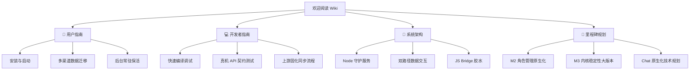

# 欢迎来到 ST-android-setting Wiki 知识库

> [!NOTE]
> **ST-android-setting** 是一个第三方的独立 SillyTavern 安卓客户端。它沿用了上游的核心嵌入式 Node.js 运行时能力，致力于通过 Jetpack Compose 与 Material Design 3 打造纯原生的移动端管理体验，并通过 Chat WebView 桥接承载核心聊天生成，实现“原生端管理，WebView 聊天”的渐进式 App 化演进。

---

## 🎯 项目核心愿景

* **开箱即用，零配置运行**：内置嵌入式 Node.js 编译环境及 SillyTavern 完整源码，用户无需安装 Termux 或进行复杂的端口配置，一键即可在安卓端运行。
* **原生 Compose + Material 3**：首页工作台、角色库管理、设置面板、诊断日志以及备份恢复全面原生化，摆脱繁重的桌面端 Web 适配限制。
* **注重隐私，安全无遥测**：数据百分之百存储在本地，不附带任何遥测、分析或三方上报。除更新检查、npm 与自定义内核包下载外，无额外网络流量。
* **极致性能与保活机制**：前台服务常驻，结合优雅的端口占用探测、崩溃监测以及自动重启机制，为移动端使用提供稳定可靠的守护。

---

## 🚀 快速导航

为了帮助您快速了解项目，我们建议您阅读以下专题页面：



### 📖 用户指南
* **[安装与启动](User-Guide#1-安装与启动)**：如何获取最新安装包并首次启动内核。
* **[多渠道数据迁移](User-Guide#2-数据迁移)**：支持 PC、Termux 备份一键归档恢复，全面兼容原版 SillyTavern 用户备份。
* **[自定义版本内核](User-Guide#3-自定义版本与更新)**：教您如何利用 ZIP 归档或自定义 GitHub 仓库/分支在手机上运行特定版本的 SillyTavern。
* **[后台电池保活](User-Guide#4-电池保活与后台优化)**：在各厂商深度定制系统（ROM）下确保前台 Node 运行时不被强杀的实操方法。

### 💻 开发者指南
* **[快速开始与编译](Developer-Guide#1-环境与编译)**：搭建 Android SDK + JDK 17 环境，一键构建 Debug 变体。
* **[真机 API 契约测试](Developer-Guide#2-契约测试与真机调试)**：详解如何使用 adb 端口转发将测试套件安全地与真机上的运行实例连通，避免单测破坏真实数据。
* **[上游固化同步规范](Developer-Guide#3-上游同步与发布流程)**：拉取 SillyTavern 最新源码提交后，如何运行自动化套件与真机回归，进行 AGPL 合规审查。

### 📐 系统架构
* **[核心组件设计](Architecture#1-内核运行时与核心组件)**：透视 `NodeService`、`NodePayload` 和 `AppPaths` 的协作逻辑。
* **[双路径数据设计](Architecture#3-数据交互-双路径设计)**：理解 `TavernCoreClient`（API 优先）与 `LocalTavernLibraryReader`（本地文件只读缓存）的混合读取与保真机制。
* **[JS Bridge 桥接增强](Architecture#4-js-bridge-原生能力增强)**：了解 `@JavascriptInterface` 的注入机制以及文件选择、图片分享、TTS 桥接等平台能力。

### 🏁 里程碑与演进规划
* **[M2 角色原生管理](Milestone-M2-Characters)**：详细展示角色列表、高级排序、嵌入标签筛选以及 multipart 表单安全换头像的原生实现细节。
* **[M3 内核与稳定性](Milestone-M3-Core-Stability)**：了解如何通过设置快照（Snapshot）、导入确认清单、非主动退出捕获以及崩溃日志脱敏等核心功能提高大版本稳定性。
* **[Chat 原生化规划](Milestone-Chat-Migration)**：展望未来的原生聊天页面。分析单一活动聊天状态源设计、Bridge 双向事件信封，以及如何承接 Tool Calling 和流式生成。

---

## 🛠️ 如何同步本 Wiki
本目录下的所有文件均采用平面化、无子目录的扁平结构进行管理，符合 GitHub Wiki 的原生版本库设计。
如果您拥有该项目的 Wiki 仓库写权限，可以通过以下步骤一键将本地 `wiki/` 目录的更新推送到线上：

1. **克隆项目的 Wiki 版本库**：
   ```bash
   git clone https://github.com/5151561/ST-android-setting.wiki.git
   ```
2. **复制本地更新**：
   将本项目代码库中 `wiki/` 目录下的所有文件（包括 `_Sidebar.md` 和各 `.md` 文件）覆盖复制到刚才克隆的 Wiki 根目录下。
3. **提交并推送**：
   ```bash
   git add .
   git commit -m "docs: sync repo wiki to github"
   git push origin master
   ```
