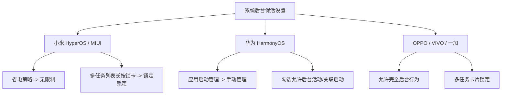

# 用户与数据迁移指南

本指南专为最终用户编写，涵盖应用的安装说明、从 PC/Termux 迁移数据的三种方法、自定义内核版本，以及深度定制系统下的电池保活优化设置。

---

## 1. 安装与启动

### 1.1 获取应用
1. 访问项目的 [Releases](https://github.com/5151561/ST-android-setting/releases) 页面，下载最新的打包 APK。
2. 安装时，Android 系统可能会弹出安全警告。这是因为该安装包是第三方独立分支，请在系统设置中**“允许来自此来源的未知应用安装”**。

### 1.2 首次启动与环境就绪
* 首次打开应用时，程序会自动在后台提取内置的 Node.js 运行时环境及 SillyTavern 初始包（此过程一般耗时 3-10 秒）。
* **通知权限**：当应用请求发送通知权限时，**请务必选择“允许”**。这是因为应用的 Node.js 运行时在后台以前台服务（Foreground Service）挂载，系统栏的常驻通知能极大地避免服务被系统自动回收。

---

## 2. 数据迁移

如果您此前在 PC 电脑、云服务器或安卓 Termux 环境中运行 SillyTavern，可以通过以下三种极其简便的方式，将您宝贵的聊天记录、角色卡片及个性化配置一键迁移至本应用中。

### 📂 三种迁移方式对比

| 迁移渠道 | 适用场景 | 详细步骤 |
|---|---|---|
| **方法一：官方备份文件** | 最推荐的通用手段，支持全平台互转。 | 1. 在旧的 SillyTavern Web 界面中打开：**User Settings** ⚙️ → **Account** → 点击 **Download Backup** 下载一个 `.zip` 格式的完整配置压缩包。<br>2. 在本应用中：切入“工具”标签页 → 点击 **管理 ST** → 点击 **导入数据** → 在系统文件选择器中选中刚才下载的备份包。<br>3. 导入完成：应用会自动扫描覆盖，您可在详情清单确认角色和聊天数量无误后，重新启动服务即可使用。 |
| **方法二：一键脚本 (Termux/Linux)** | 适用于高级用户，直接打包 Termux 内置的数据。 | 1. 在您的 Termux 或 Linux 控制台中，运行以下一键脚本指令：<br>`bash <(curl -sSf https://raw.githubusercontent.com/Sanitised/ST-android/master/tools/export_to_st_android.sh)`<br>*(若您的 SillyTavern 装在自定义目录，请先 `cd` 进对应的文件夹)*<br>2. 脚本会在您的本地生成一个名为 `st_backup.tar.gz` 的压缩包。<br>3. 如果使用 Termux，可运行 `termux-setup-storage` 并将压缩包复制到手机的 Downloads 目录下。<br>4. 在应用中进入 **管理 ST** → **导入数据** 选中此文件即可还原。 |
| **方法三：手动打包还原** | 适用于通过文件管理器手动挑选备份。 | 1. 在您的电脑或手机文件管理器中新建一个名为 `st_backup` 的空文件夹。<br>2. 将您原有的 `config.yaml` 配置文件和整个 `data` 目录复制进去。<br>3. 将该结构使用 zip 或 tar 压缩。目录层级必须如下所示：<br>```text<br>st_backup.zip<br> └── st_backup/<br>      ├── config.yaml<br>      └── data/<br>```<br>4. 复制该压缩包至手机中，在应用的 **管理 ST** → **导入数据** 模块完成导入。 |

---

## 3. 自定义版本与更新

本应用的一大特色是**不把您的 SillyTavern 内核锁死在当前编译包中**。您不仅可以自动检查并拉取最新 Release，还能随心所欲地切换到特定版本：

### 🛠️ 自定义内核操作流程
1. 进入应用底栏的“工具” -> 点击 **管理 ST (Manage ST)** 页面。
2. 找到 **自定义安装 (Custom Install)** 区域：
   * **指定 Git 分支/标签**：您可以输入任意官方上游仓库或三方分支（例如 `https://github.com/SillyTavernAI/SillyTavern` 分支 `release` 或 `staging`），应用会调用嵌入式环境拉取部署。
   * **ZIP 压缩包直接安装**：您可以自行从 GitHub 页面下载特定版本的 `.zip` 发布包，在应用中选中安装，它会自动清理旧内核并完成无缝替换。
3. 内核升级或切换时，**您的角色卡片与历史聊天（`data/` 目录）将受到底层安全沙箱的严格保护，绝不会被删除或覆盖**。

---

## 4. 电池保活与后台优化

由于安卓系统的墓碑机制（Doze Mode）及各大厂商（如小米、华为、OPPO、VIVO 等）深度定制系统的激进后台策略，在您锁屏或切入其他应用进行深层扮演时，系统可能会强杀后台的 Node 运行时。

请参考以下设置进行优化，以获得最持久的会话守护：

### 4.1 电池优化白名单
* 进入应用的 **设置 (Settings)** 页面，点击 **电池优化白名单 (Disable Battery Optimization)** 快捷入口。
* 系统会弹窗询问是否允许该应用在后台高能耗运行，请务必选择 **“允许”**。

### 4.2 各品牌 ROM 专项常驻设置



* **小米 (HyperOS / MIUI)**：
  1. 打开“设置” -> “应用设置” -> “授权管理” -> “自启动管理” -> 开启本应用。
  2. 进入多任务管理后台，长按本应用卡片，点击 **锁定 🔒** 按钮，防止一键清理。
  3. 长按桌面应用图标 -> “应用信息” -> “省电策略” -> 修改为 **“无限制”**。
* **华为 (HarmonyOS / 鸿蒙)**：
  1. 打开“手机管家” -> “应用启动管理” -> 找到本应用 -> 关闭“自动管理”，在弹出的手动管理框中开启 **“允许后台活动”**、**“允许自启动”** 和 **“允许关联启动”**。
* **OPPO / VIVO / 一加**：
  1. 进入“设置” -> “电池” -> “后台耗电管理” -> 选择本应用 -> 修改为 **“允许完全后台行为”**。
  2. 同样在多任务界面长按或下滑本应用卡片，选择 **“锁定”**。

### 4.3 独立私有空间 / 安全文件夹支持
* 本应用完美兼容 Android 15 的 **Private Space (私有空间)**、三星的 **Secure Folder (安全文件夹)** 以及各机型的多用户配置。
* 当您在双开环境或安全文件夹中使用时，所有本地生成的数据将与主空间物理隔离，给您的聊天隐私加上双重保险。
